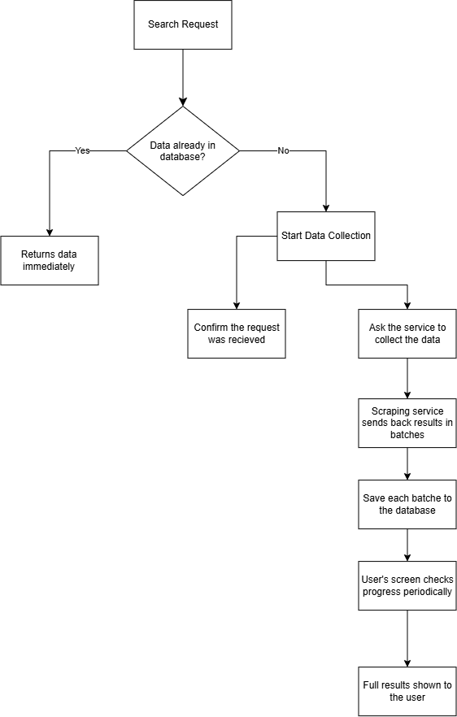
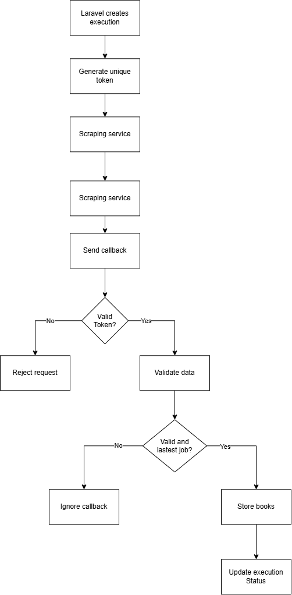
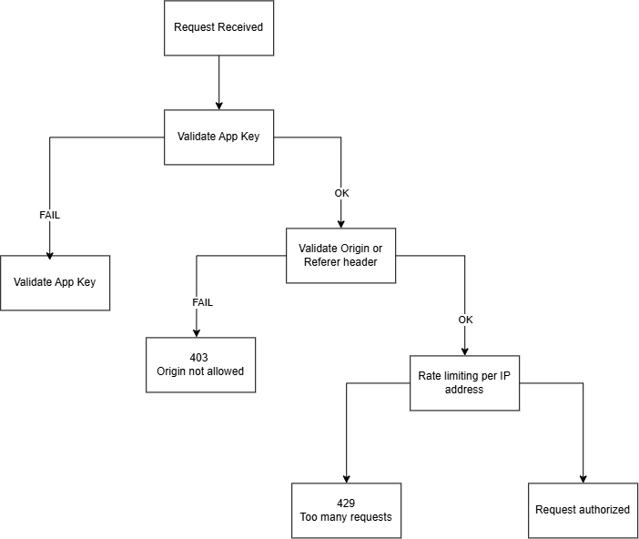
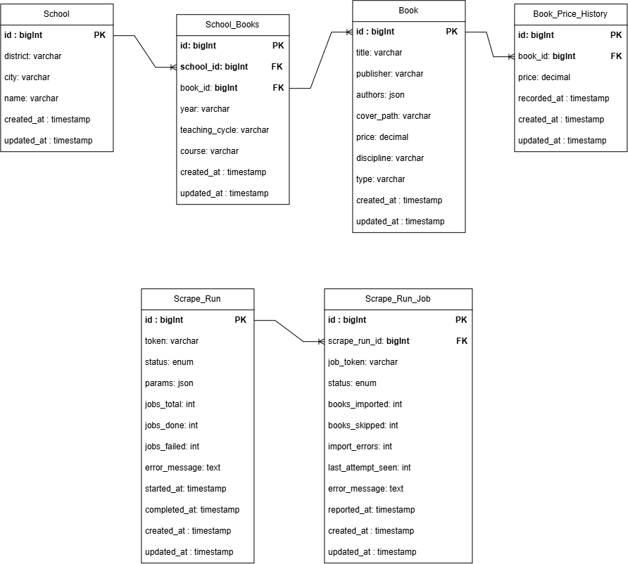

# WebScrapperApi

Laravel backend for **Recolha e Gestão Automatizada de Manuais Escolares** — a system that turns manual, repetitive navigation on the [Wook](https://www.wook.pt) school-textbook lookup page into a structured, queryable API.

This repository is the **central component** of a three-part architecture:

- **This repo (Laravel)** — owns the database, exposes the public REST API, authenticates and validates all traffic, dispatches scrape requests, and reconciles results into `schools` / `books` / `school_books`.
- **[WebScrapper](https://github.com/ricardo4457/WebScrapper) (Node.js / Playwright / BullMQ)** — does the actual browser automation against Wook and reports results back via callback.
- **[WebScrapper-Frontend](https://github.com/ricardo4457/WebScrapper-Frontend) (Vue 3 / Pinia)** — the guided search wizard consumed by end users.

Laravel never touches a browser and the Node service never touches the database — the only contract between them is an authenticated HTTP callback. See [Architecture](#architecture) below.

---

## Table of Contents

- [Why this exists](#why-this-exists)
- [Architecture](#architecture)
- [Request flows](#request-flows)
  - [Search request lifecycle](#search-request-lifecycle)
  - [Node → Laravel callback](#node--laravel-callback)
  - [Public API authentication](#public-api-authentication)
- [Database schema](#database-schema)
- [API reference](#api-reference)
- [Getting started](#getting-started)
- [Configuration](#configuration)
- [Testing](#testing)
- [Related repositories](#related-repositories)

---

## Why this exists

Wook does not expose a public API for school textbook lists. Getting a list means manually clicking through year → teaching cycle → district → city → school → course → subjects, every single time, for every school. This project automates that navigation and caches the result, so that:

- A search that's already been scraped returns from the database instantly.
- A search that's missing or stale triggers a background scrape and the frontend polls until it's ready.
- Price history is preserved across scrapes instead of being overwritten.

## Architecture

Laravel is the single source of truth for state. It decides *when* a scrape is needed, asks the Node service to run it, and is the only component with database access.

- `ScrapeDispatchService` — the single entry point used to talk to the Node service, called by every controller/service that can trigger a scrape (explicit `POST /book-scraper/run*` endpoints, and the automatic cache-miss/stale-cache fallback in `BookSearchService` / `BookController`).
- `ScrapeRunService` / `ScrapeJobService` — own the lifecycle of a `ScrapeRun` (one user-triggered operation) and its child `ScrapeRunJob`s (one per BullMQ job — e.g. one per school in a district-wide scrape).
- `ScrapeCallbackService` — processes streamed partial batches and the final signal sent back by the Node worker, with idempotency guarded by `attempt`/`last_attempt_seen` so retries and duplicate callbacks can't double-count progress.
- `BookImportService` — reconciles a scraped payload against `school_books` for a given `(school, year, teaching_cycle, course)` scope: adds new links, removes ones no longer present, and never duplicates a `Book` (matched on `title` + `publisher`).
- `BookPriceHistoryService` — appends to `book_price_histories` only when the price actually changed (tolerance-based comparison), and always keeps `books.price` in sync.

## Request flows

### Search request lifecycle

`GET /api/books/search` (and the equivalent school/course/discipline lookup endpoints) all follow the same `discover=1` pattern: try the cache, and only pay the cost of a scrape when the cache genuinely has nothing.



- **Cache hit** → data is returned immediately, no scrape involved.
- **Cache miss** → a `ScrapeRun` is created and dispatched to Node, the client gets `202 Accepted` with a `run_id`, and the frontend polls `GET /book-scraper/status/{runId}` until the run reaches a terminal state.
- Results are **not** returned in a single blob at the end — the Node worker streams them back in batches as they're scraped (see below), so the run's progress and partial import counts are visible while it's still in flight.
- Stale-but-present cache data (older than 12 months) is returned immediately *and* triggers a silent background refresh — the user never waits for that refresh.

### Node → Laravel callback

Every batch of scraped books — and the final completion signal — arrives at `POST /api/book-scraper/callback`, authenticated per-request rather than per-session, since there's no user session to authenticate against.



- **Token validation** happens twice, at two different layers, on purpose: `VerifyNodeApiKey` (middleware) confirms `run_token` belongs to a real `ScrapeRun` before the request is even routed to a controller; `ScrapeCallbackRequest` (Form Request) then validates the payload shape.
- **Attempt tracking**: each `ScrapeRunJob` records `last_attempt_seen`. A callback whose `attempt` is lower than what's already recorded is silently ignored — this is what makes retried/duplicated BullMQ jobs safe to process more than once.
- **Import only happens on valid, latest-attempt data** — anything else is logged and dropped, never partially applied.

### Public API authentication

Endpoints consumed by the Vue frontend sit behind a three-layer defense: application key → request origin → rate limiting.



- `VerifyAppApiKey` — compares `X-App-Key` against `APP_API_KEY` using `hash_equals()` (timing-attack resistant). Missing server-side config fails closed with `503`, not open.
- `VerifyRequestOrigin` — checks `Origin` (falling back to `Referer`) against `services.frontend.allowed_origins`.
- Rate limiting is **tiered by cost**, not applied uniformly: `scrape-run` (5/min) for single-school scrapes, `scrape-run-heavy` (1/min) for district/city/teaching-cycle scrapes, `scrape-lookup` (30/min) for read endpoints that only *sometimes* trigger a scrape via `discover=1`.

This is deliberately **not** the same authentication mechanism used for the Node → Laravel callback above — that one is a shared secret scoped to a single execution (`run_token`), not an application-wide key, since it's service-to-service and not tied to any frontend session.

## Database schema



| Table | Purpose |
|---|---|
| `schools` | One row per physical school, keyed by `name` (district/city come from the scrape). |
| `books` | Deduplicated by `(title, publisher)` — the same manual adopted by 50 schools is stored once. |
| `school_books` | Many-to-many join, scoped by `year` + `teaching_cycle` + `course` (course is nullable — only some teaching cycles have that step). |
| `book_price_histories` | Append-only price log per book; `books.price` always holds the latest value. |
| `scrape_runs` | One row per user-triggered operation; tracks `jobs_total` / `jobs_done` / `jobs_failed` and overall status. |
| `scrape_run_jobs` | One row per BullMQ job within a run; tracks `last_attempt_seen`, import counters, and per-job `import_errors`. |

## API reference

| Endpoint | Method | Auth | Notes |
|---|---|---|---|
| `/api/book-scraper/run` | POST | App key + origin | Single-school scrape (`single_school`, `single_school_tooltip`) |
| `/api/book-scraper/run/district` | POST | App key + origin | Full-district scrape, heavy rate limit |
| `/api/book-scraper/run/city` | POST | App key + origin | Full-city scrape, heavy rate limit |
| `/api/book-scraper/run/teaching-cycle` | POST | App key + origin | Full-teaching-cycle scrape, heavy rate limit |
| `/api/book-scraper/status/{runId}` | GET | App key + origin | Aggregated run + per-job progress |
| `/api/book-scraper/callback` | POST | `X-API-KEY` / `run_token` | Node → Laravel only, never called by the frontend |
| `/api/books/search` | GET | App key + origin | School / title search; may return `202` + `run_id` on cache miss |
| `/api/books/{book}` | GET | Public | Read-only, no scrape |
| `/api/books/{book}/price-history` | GET | Public | Read-only, no scrape |
| `/api/schools` | GET | App key + origin | Supports `discover=1` fallback |
| `/api/schools/{school}/courses` | GET | App key + origin | Supports `discover=1` fallback |
| `/api/schools/{school}/disciplines` | GET | App key + origin | Supports `discover=1` fallback |
| `/api/locations` | GET | Public | Districts / cities already scraped at least once |

## Getting started

```bash
git clone https://github.com/ricardo4457/WebScrapperApi.git
cd WebScrapperApi
composer install
cp .env.example .env
php artisan key:generate
php artisan migrate
php artisan serve
```

You'll also need the [Node scraper service](https://github.com/ricardo4457/WebScrapper) running (via Docker Compose — see that repo) for scrape dispatch to actually succeed; without it, `discover=1` requests will fail closed and return `500`.

## Configuration

Key `.env` variables:

```env
APP_API_KEY=                          # shared secret validated against X-App-Key from the frontend
NODE_SCRAPER_URL=                     # base URL of the Node scraper service
NODE_SCRAPER_CALLBACK_BASE_URL=       # base URL Laravel is reachable at, used to build the callback_url sent to Node
```

`config/services.php` also defines `frontend.allowed_origins` for the origin-check middleware — update this per environment.

## Testing

```bash
php artisan test
```

Test suite (Pest) covers services (`ScrapeRunService`, `ScrapeJobService`, `ScrapeCallbackService`, `BookImportService`, `BookPriceHistoryService`, `ScrapeDispatchService`), middleware (`VerifyAppApiKey`, `VerifyRequestOrigin`), and full HTTP integration tests for the callback and scrape-controller endpoints, including idempotency, stale-attempt rejection, and duplicate-callback handling.

## Related repositories

- Scraper (Node.js / Playwright / BullMQ): https://github.com/ricardo4457/WebScrapper
- Frontend (Vue 3 / Pinia): https://github.com/ricardo4457/WebScrapper-Frontend
